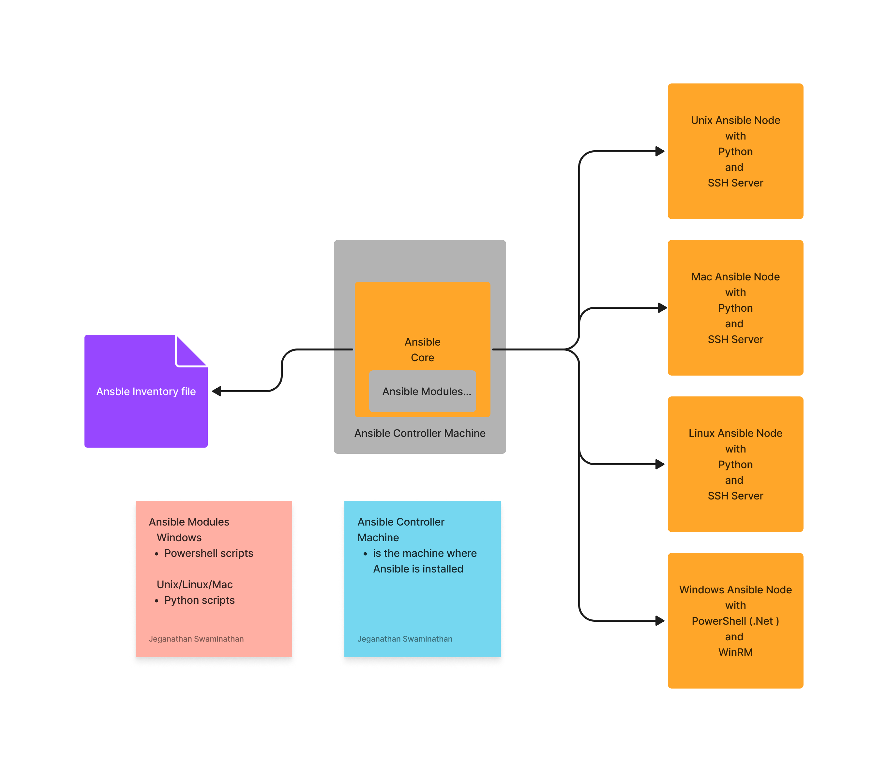

# Day 1

## What is a provisioner tool?
- this type of tools helps us creating a virtual machine locally or on cloud on demand
- Examples
  - Vagrant 
    - using declarative code we can create virtual machine on virtual box or VMWare hypervisors
  - Terraform ( Infrastruction automation tools )
     - can automate provisioning on any cloud (Local environment, AWS, AZure, Digital Ocean, GCP .,)
  - Cloudformation ( Infrastruction automation tools )
    - a proprietary tool used within AWS to automate infrastructure
    - doesn't support Azure, GCP, Digital Ocean, etc.,

## What is Configuration Management Tool?
- helps us in automating software installation of local as well as on remote servers
- on existing infrastructure software installation automations can be automated using Configuration Management Tools
- Examples
  - Chef
  - Puppet
  - SaltStack ( Salt )
  - Ansible
  
## Chef, Puppet and SaltStack
- they follow Client/Server Architecture
- Domain Specific Language ( language in which automation code is written )
  - Ruby ( scripting language )
  - learning curve is steep
- You need to install proprietrary tools for developing automation code
- You need to install proprietary agent tools on the Chef/Puppet Nodes
- Installation is complex
- Follows pull-based architecture

## Ansible
- agentless i.e you don't need to install any proprietary tools in order to perform automated installations on the Ansible nodes
- follows a PUSH based architecture
- doesn't follow client/server architecture
- the machine where Ansible is installed is called as Ansible Controller Machine(ACM)
- this can only be Linux and Unix like OS
- Windows server/OS can never act as an Ansible Controller Machine
- ansible can automate software installations on
  - Unix
  - Linux
  - Windows
  - Mac
  - Cisco Routers/Switches, etc.,
- Domain Specific Language (DSL)
  - YAML ( Yet Another Markup Langauage )
- Ansible is developed in Python by Michael Deehan ( a former Red Hat employee )
- Michael Deehan started a company called Ansible Inc, through this company he developed Ansible Core as an opensource product
- Red Hat acquired Ansible Inc, Ansible Core is a Red Hat product
- Red Hat started developing an Enterprise variant of Ansible core called Ansible Tower
- Ansible Core supports only Command LIne Interface (CLI)
- Ansible Tower supports 
    - developed on top of Ansible Core, hence all playbooks written for Ansible core will also
      work in Ansible Tower
    - Web console (GUI)
    - User Management
    - Support from Red Hat
    - You could see the history of playbook executions and logs, metrics ,etc in GUI


## What is an Ansible Node?
- is the server where automated software installations must be performed
- Ansible Nodes can be a
  - Windows machine
  - Mac OS-X
  - Unix
  - Linux ( all distributions )
  - Switches & Routers, etc.,
- Windows Ansible Nodes
  - software requirements
    - Powershell should be there (.Net Framework)
    - WinRM should be configured for connectivity
- Unix/Mac/Linux Ansible Nodes
  - Software requirements
    - Python should be there
    - SSH Server should be installed for connectivity

## Ansible High-Level Architecture


## Installing Ansible in Ubuntu
```
sudo apt update
sudo apt install software-properties-common
sudo add-apt-repository --yes --update ppa:ansible/ansible
sudo apt install ansible
```

## Cloning TekTutor Training Repository
```
cd ~
git clone https://github.com/tektutor/ansible-jan-2023
```

## Lab - Building a custom Ubuntu Docker Image to create Ubuntu Ansible Node
```
cd ~/ansible-jan-2023
git pull

cd Day1/CustomDockerImages/ubuntu
ssh-keygen
cp ~/.ssh/id_rsa.pub authorized_keys
docker build -t tektutor/ansible-ubuntu:latest .
docker images
```

### Creating two ubuntu containers ( ansible nodes machines )
```
docker run -d --name ubuntu1 --hostname ubuntu1 -p 2001:22 -p 8001:80 tektutor/ansible-ubuntu:latest

docker run -d --name ubuntu2 --hostname ubuntu2 -p 2002:22 -p 8002:80 tektutor/ansible-ubuntu:latest
```

Expected output
<pre>
jegan@tektutor.org:~/ansible-jan-2023/Day1$ <b>docker run -d --name ubuntu1 --hostname ubuntu1 -p 2001:22 -p 8001:80 tektutor/ansible-ubuntu:latest</b> 
c21dc91e8bdfe8fd732fa623b970cdfb25db9249fa00311493d75ec82d2a2714

jegan@tektutor.org:~/ansible-jan-2023/Day1$ <b>docker run -d --name ubuntu2 --hostname ubuntu2 -p 2002:22 -p 8002:80 tektutor/ansible-ubuntu:latest</b>
0c41e712ec3299eaaa37b14fea72b6a2fb90a8bd71fdb9574fad45ffbf77ecf1

jegan@tektutor.org:~/ansible-jan-2023/Day1$ <b>docker ps</b>
CONTAINER ID   IMAGE                            COMMAND               CREATED          STATUS          PORTS                                                                          NAMES
0c41e712ec32   tektutor/ansible-ubuntu:latest   "/usr/sbin/sshd -D"   3 seconds ago    Up 2 seconds    0.0.0.0:2002->22/tcp, :::2002->22/tcp, 0.0.0.0:8002->80/tcp, :::8002->80/tcp   ubuntu2
c21dc91e8bdf   tektutor/ansible-ubuntu:latest   "/usr/sbin/sshd -D"   14 seconds ago   Up 13 seconds   0.0.0.0:2001->22/tcp, :::2001->22/tcp, 0.0.0.0:8001->80/tcp, :::8001->80/tcp   ubuntu1
</pre>

### Testing if your ubuntu1 and ubuntu2 containers are prepared as per ansible requirement
SSH into the ubuntu1 ansible node
```
ssh -p 2001 root@localhost
```

Expected output
<pre>
jegan@tektutor.org:~/ansible-jan-2023/Day1$ <b>ssh -p 2001 root@localhost</b>
The authenticity of host '[localhost]:2001 ([127.0.0.1]:2001)' can't be established.
ED25519 key fingerprint is SHA256:ePS/H9aTYQiQP9uX7HwfcEltipzTw67CFBLMdMxFxaw.
This key is not known by any other names
Are you sure you want to continue connecting (yes/no/[fingerprint])? <b>yes</b>
Warning: Permanently added '[localhost]:2001' (ED25519) to the list of known hosts.
Welcome to Ubuntu 16.04.7 LTS (GNU/Linux 5.15.0-58-generic x86_64)

 * Documentation:  https://help.ubuntu.com
 * Management:     https://landscape.canonical.com
 * Support:        https://ubuntu.com/advantage

The programs included with the Ubuntu system are free software;
the exact distribution terms for each program are described in the
individual files in /usr/share/doc/*/copyright.

Ubuntu comes with ABSOLUTELY NO WARRANTY, to the extent permitted by
applicable law.

root@ubuntu1:~# <b>exit</b>
logout
Connection to localhost closed.
</pre>

SSH into ubuntu2 ansible node
```
ssh -p 2002 root@localhost
```

Expected output
<pre>
jegan@tektutor.org:~/ansible-jan-2023/Day1$ <b>ssh -p 2002 root@localhost</b>
The authenticity of host '[localhost]:2002 ([127.0.0.1]:2002)' can't be established.
ED25519 key fingerprint is SHA256:ePS/H9aTYQiQP9uX7HwfcEltipzTw67CFBLMdMxFxaw.
This host key is known by the following other names/addresses:
    ~/.ssh/known_hosts:10: [hashed name]
Are you sure you want to continue connecting (yes/no/[fingerprint])? <b>yes</b>
Warning: Permanently added '[localhost]:2002' (ED25519) to the list of known hosts.
Welcome to Ubuntu 16.04.7 LTS (GNU/Linux 5.15.0-58-generic x86_64)

 * Documentation:  https://help.ubuntu.com
 * Management:     https://landscape.canonical.com
 * Support:        https://ubuntu.com/advantage

The programs included with the Ubuntu system are free software;
the exact distribution terms for each program are described in the
individual files in /usr/share/doc/*/copyright.

Ubuntu comes with ABSOLUTELY NO WARRANTY, to the extent permitted by
applicable law.

root@ubuntu2:~# <b>exit</b>
logout
Connection to localhost closed.
</pre>


## Lab - Running ansible ad-hoc commands using static inventory
```
cd ~/ansible-jan-2023
git pull

cd Day1/Ansible
ansible -i inventory all -m ping
```

Expected output
<pre>
jegan@tektutor.org:~/ansible-jan-2023/Day1/Ansible$ <b>ansible -i inventory all -m ping</b>
ubuntu1 | SUCCESS => {
    "ansible_facts": {
        "discovered_interpreter_python": "/usr/bin/python3"
    },
    "changed": false,
    "ping": "pong"
}
ubuntu2 | SUCCESS => {
    "ansible_facts": {
        "discovered_interpreter_python": "/usr/bin/python3"
    },
    "changed": false,
    "ping": "pong"
}
</pre>
