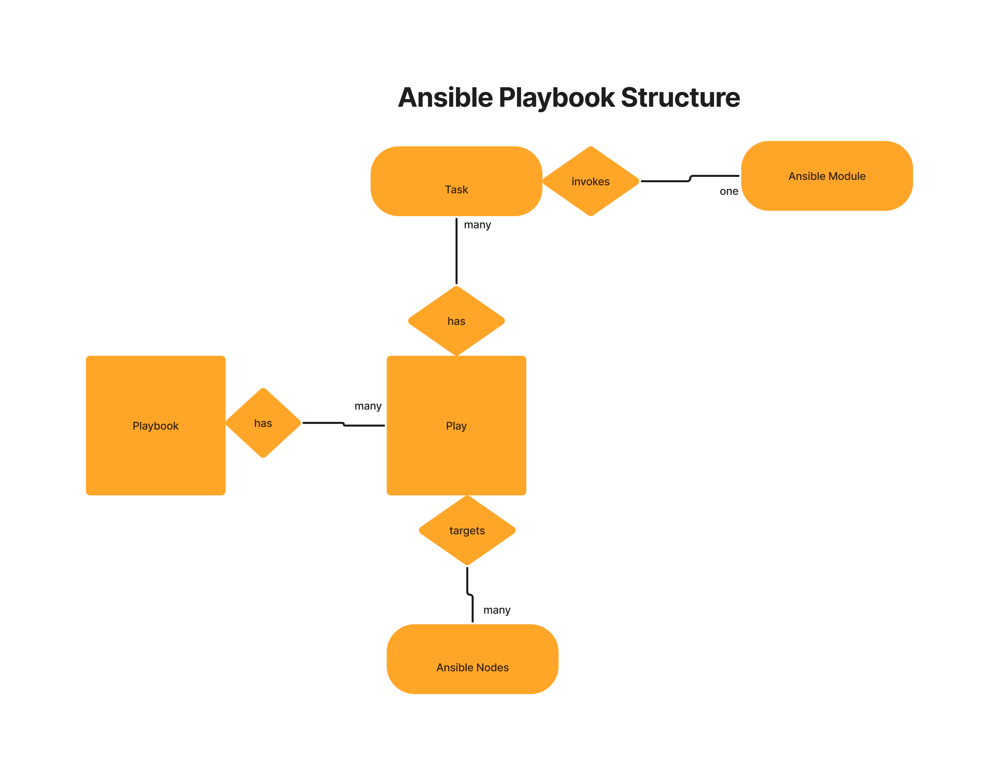

# Day2

## Ansible Playbook Structure


## Lab - Executing an ansible playbook
```
cd ~/ansible-jan-2023
git pull

cd Day2
ansible-playbook -i ../Day1/Ansible/inventory ping-playbook.yml
```

Expected output
<pre>
(jegan@tektutor.org)$ <b>ansible-playbook -i ../Day1/Ansible/inventory ping-playbook.yml</b>

PLAY [This playbook demonstrates invoke ping module] *************************************************

TASK [Gathering Facts] *******************************************************************************
ok: [ubuntu1]
ok: [ubuntu2]

TASK [Ping the ansible node] *************************************************************************
ok: [ubuntu1]
ok: [ubuntu2]

PLAY RECAP *******************************************************************************************
ubuntu1                    : ok=2    changed=0    unreachable=0    failed=0    skipped=0    rescued=0    ignored=0   
ubuntu2                    : ok=2    changed=0    unreachable=0    failed=0    skipped=0    rescued=0    ignored=0  
</pre>

## Lab - Install nginx, configuring it and deploy custom web page
```
cd ~/ansible-jan-2023
git pull

cd Day2
ansible-playbook install-nginx-playbook.yml
```

Expected output
<pre>
(jegan@tektutor.org)$ ansible-playbook install-nginx-playbook.yml 

PLAY [This playbook will install nginx, configures web root folder, deploys custom web page] *****************************

TASK [Gathering Facts] ***************************************************************************************************
ok: [ubuntu2]
ok: [ubuntu1]

TASK [Install nginx] *****************************************************************************************************
ok: [ubuntu2]
ok: [ubuntu1]

TASK [Configure nginx web root folder] ***********************************************************************************
ok: [ubuntu1]
ok: [ubuntu2]

TASK [Create custom nginx web root folder] *******************************************************************************
ok: [ubuntu1]
ok: [ubuntu2]

TASK [Restart the nginx web server service] ******************************************************************************
changed: [ubuntu1]
changed: [ubuntu2]

TASK [Deploy custom web page] ********************************************************************************************
changed: [ubuntu1]
changed: [ubuntu2]

PLAY RECAP ***************************************************************************************************************
ubuntu1                    : ok=6    changed=2    unreachable=0    failed=0    skipped=0    rescued=0    ignored=0   
ubuntu2                    : ok=6    changed=2    unreachable=0    failed=0    skipped=0    rescued=0    ignored=0   

(jegan@tektutor.org)$ curl 172.17.0.3
<html>
    <head>
        <title>Welcome to DevOps!</title>
    </head>
    <body>
        <h1>Provisioned by Docker</h1>
        <h1>Configured by Ansible</h1>
        <h1>Hostname - ubuntu2</h1>
        <h1>OS - Ubuntu v16.04</h1>
    </body>
</html>
(jegan@tektutor.org)$ curl 172.17.0.2
<html>
    <head>
        <title>Welcome to DevOps!</title>
    </head>
    <body>
        <h1>Provisioned by Docker</h1>
        <h1>Configured by Ansible</h1>
        <h1>Hostname - ubuntu1</h1>
        <h1>OS - Ubuntu v16.04</h1>
    </body>
</html>

</pre>
